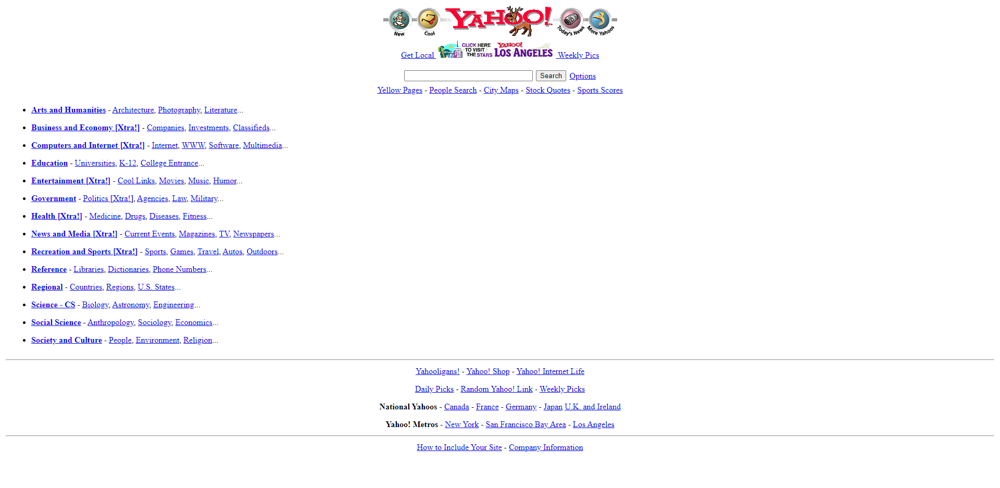

# Yahoo UI Clone (1996)
This is a clone of the Yahoo homepage as it appeared in 1996. 
The goal of this project is to showcase the classic design and layout techniques prevalent during that era. 
The entire layout is created using HTML and HTML tables.

## Overview

## Link to yahoo 1996 UI

in case you want to check it out form wayback machine: 
[Yahoo 1996](https://web.archive.org/web/19961020022754/http://www9.yahoo.com:80/) 

## Getting Started
To clone and run this project locally, follow these steps:
- Clone the Repository: git clone https://github.com/mohammedamcs/yahoo1996-clone.git
- Navigate to the project directory: cd yahoo1996-clone
- Open the yahoo.html file in your preferred web browser.
